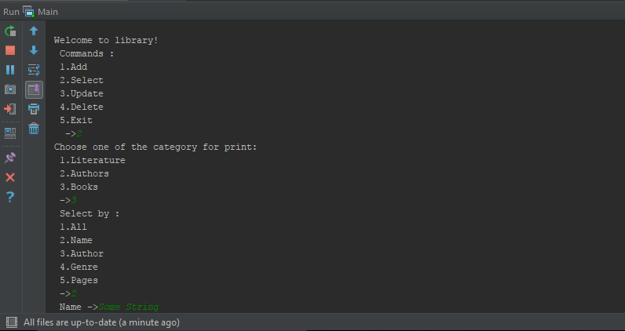

# Library
Simple library console application

## Contains all main functions :
  * Create
  * Read
  * Update
  * Delete
  
## Navigate  :
  * Navigate going by numbers : 
  
  * If you going to find book by name, type a string : 
  
## Built With

* [Spring](https://spring.io/) - The web framework used
* [Maven](https://maven.apache.org/) - Dependency Management

## Authors

* **Roman Kovaliov** - *Initial work* - [Nevermind1993k](https://github.com/Nevermind1993k)
